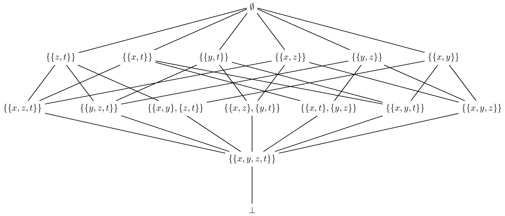

=================
Equalities domain
=================

.. MOPSA developer manuel

.. raw:: org

   #+LABEL: relational-domain_equalities-domain

The equalities abstract domain is a simple relational domain which aims
at tracking equalities between variables in a program. In order to do so
the abstract states is a set of sets of variables (:math:`S^{\sharp} \in
\wp(\wp(\mathcal V))` such that :

.. math::

   \gamma(S^{\sharp}) = \{\rho \in \mathcal V \rightarrow \mathbb V \mid
   \forall s \in S^{\sharp}, \exists v \in \mathbb V, \forall x \in s, \rho(x)
   = v\}

It is easy to see that:

-  an abstract elements :math:`S^{\sharp}` containing two intersecting
   sets represents exactly the same set of concrete states as this same
   abstract elements but where the two intersecting sets of states have
   been replaced by their union.
-  an abstract element :math:`S^{\sharp}` containing a singleton set
   represents exactly the same set of concrete states as this same
   abstract element where the singleton has been removed.

Abstract elements therefore enjoy a *normalized form* which does not
contain intersecting sets and does not contain singleton sets. These
normalized forms are partitions of the set of variables.

The lattice is finite as soon as the set of variables is finite, and the
resulting abstraction will therefore not require any widening operator.

Below is the Hasse diagram of the equalities domain over the set of
variables :math:`\{x, y, z, t\}`

As we want to showcase several level signatures for domains in **Mopsa**
without having to introduce many new abstractions we will split the
implementation of the equalities abstract domain in two phases (each
showing a new domain signature) :

#. Implementation of the basic behavior of the domain using a
   *simplified* signature (in
   :ref:`Implementation (1) <equalities-domain_implementation1>`)
#. Implementation of more advanced features using a *standard* signature
   (in :ref:`Implementation (2) <equalities-domain_implementation2>`)

In addition to the *under the rug* signature lifting performed by
**Mopsa** to combine domains together, it is of course possible to
manually lift a domain from one signature to a more expressive one
