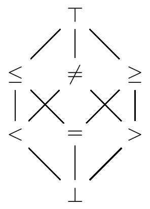

====================
Sign abstract Domain
====================

.. MOPSA developer manuel

A Value domain
==============

The sign abstract domain is a value abstraction, used to represent sets
of integers. A set of integers is represented by the sign of the
elements composing the set. For example the set :math:`\{0, 1\}` will be
represented by :math:`\geq 0`, the set :math:`\{-1, 3\}` by
:math:`\neq 0`. In the following the :math:`0` will be omitted. Below is
the Hasse diagram of the sign domain.

We do not provide a complete presentation of all abstract transfer
functions of the sign abstract domains, those can be read quite clearly
in the code provided for the sign abstraction.

An environment abstraction
==========================

The sign abstraction provides a representation of sets of integers,
whereas the concrete semantics of the Universal Language is described in
terms of sets of environments defined on the integer valued variables of
its program.

The ability to lift a value abstraction :math:`V^{\sharp}` representing
:math:`\wp(\mathbb I)` to an environment abstraction
:math:`\mathcal V \rightarrow
V^{\sharp}` representing :math:`\wp(\mathcal V \rightarrow \mathbb I)`
where every operator is lifted pointwise is a classical results of
Abstract Interpretation. This lifting can be derived automatically from
the definition of the value domain. This mechanism is provided by the
**Mopsa** framework as a way to automatically derive new abstraction,
therefore once the sign value domain is given to **Mopsa**, the
according environment abstraction will then be made available to the
user.
