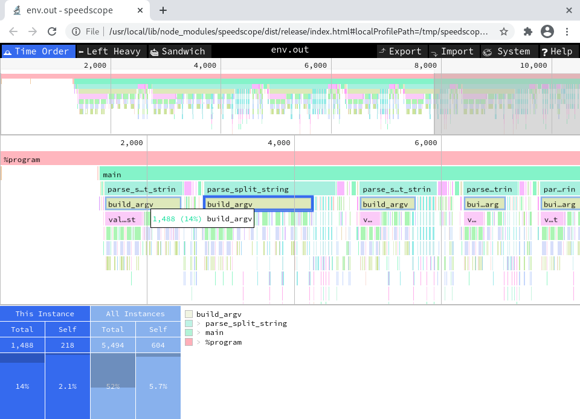

.. _hooks:

Hooks
=====

Hooks are plug-ins that can provide meta-information about an analysis.
They can observe the progress of the analysis by capturing the commands exchanged between the abstract domains, e.g. before and after a statement is executed.
Mopsa provides several ready-to-use hooks that help in debugging and profiling an analysis.
The list of available hooks can be obtained with the option ``-list hooks``.
Hooks can be activated with the option ``-hook <HOOK>``.

We detail some of the most useful hooks below.

Progress
--------

The ``progress`` hook (enabled with ``-hook progress``, then) helps tracking the progression of the analysis by printing the current callstack of the statement currently analyzed, and an approximate percentage of completion of each function in the callstack.
The percentage is based on the current statement against the total *number* of statements in the function, and does not necessarily reflect the *actual time* needed to analyze the function (especially in case of loops).
However, it is useful to track the position of the analysis and where it might be stuck.

The ``progress`` hook is best used in combination with ``-output`` to avoid mixing the progression status (displayed on the standard output) with analysis messages (stored into the output file).

Logs
----

The ``logs`` hook (``-hook logs``) displays the commands performed during an analysis, that is, the executed statements and the evaluated expressions.
Logs are organized as trees by properly indenting nested commands.
In addition, the hook also displays the input/output environments of each command.

The ``short-logs`` hook is a less verbose variant of ``logs`` that displays only the interpreter tree and omits the input/output environments.

.. raw:: html
   :file: ../resources/output/short-logs-hook.html

Function Profiler
-----------------

The ``function_profiler`` hook outputs the time spent by the analyzer in each function of the program.
At the end of the analysis, a table is shown that gives three measurements for each function:

- The ``total`` amount of time spent in the function.
- The ``self`` amount of time spent in the function that omits the time spent in children calls.
- The number of times the function was called.

The profile hook has the following command-line options:

.. program:: Function profiler hook

.. option:: -flamegraph

   Cause the hook to output a *flamegraph* of the analysis.
   To display the flamegraph, you can use for example `speedscope <https://github.com/jlfwong/speedscope>`_.

.. option:: -flamegraph-resolution (s | ms | us | ns)

   Resolution of the flame graph samples (default: ms).

Loop Profiler
-------------

A profiler for loops is implemented by the hook ``loop_profiler``.
It displays for each analyzed loop:

- The number of times the loop was reachable.
- The number of iterations at each time.
- The overall average of iterations.

Coverage
--------

Coverage hooks show which part of a file are covered by an analysis.
They are useful to check whether the analysis reached all the expected functions.
If not, it may be a sign that the analysis was misconfigured (missing stubs, inputs that are not general enough, etc.).

These hooks are currently language-specific, and written for both the C analysis and the Python analysis.

C coverage
++++++++++

The C coverage hook is called ``c.coverage``.
When the hook is activated it shows the percentage of total statements analyzed at the end of the analysis.

The hook has the following command-line options:

.. program:: C coverage hook

.. option:: -c-show-line-coverage

   Display coverage information for each line (more detailed output).

Python coverage
+++++++++++++++

The Python coverage hook is ``py.coverage``.
Similarly to the C hook, it shows the coverage percentage at the end of the analysis.
In addition, it outputs a colored version of the analyzed files in the ``/tmp`` directory (an exemple is given below).
The red color corresponds to statements never reached by the analysis, the yellow corresponds to statements reached but where the state is always bottom (meaning it is dead code for our analysis), and the green color shows statements covered by the analysis and where the state is not always bottom.

.. raw:: html
   :file: ../resources/output/python-detailed-coverage.html
